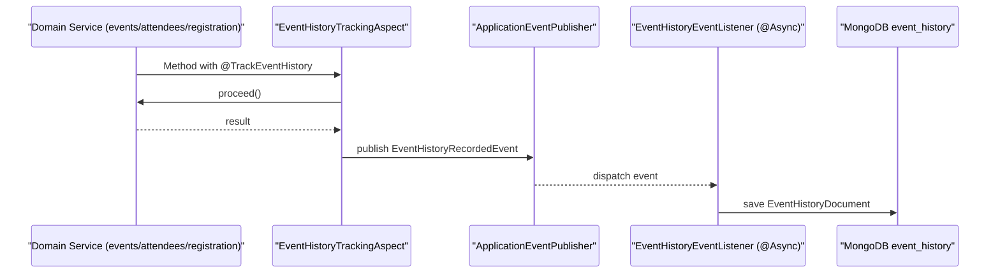
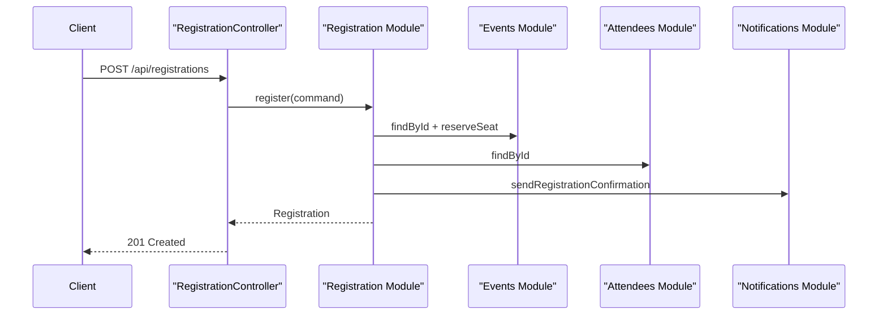

# Event Management - Architecture

## Goal
This project demonstrates a production-oriented modular monolith design for interview use:
- clear module boundaries
- async inter-module contract
- resilient external call boundary
- observable runtime behavior

## Build Coordinates
- `groupId`: `com.kkarimi`
- `artifactId`: `event-management`
- `version`: `0.0.1-SNAPSHOT`

## Base Package
`com.kkarimi.eventmanagement`

## Modules
1. `events`
- Responsibility: create events, query events, reserve seats.
- API: `EventCatalog`, `Event`, `NewEventCommand`.

2. `attendees`
- Responsibility: register attendees and query them.
- API: `AttendeeDirectory`, `Attendee`, `NewAttendeeCommand`.

3. `registration`
- Responsibility: register attendee to event.
- Dependencies: `events`, `attendees`, `notifications`, `eventhistory`.
- API: `RegistrationApplication`, `Registration`, `RegistrationCommand`.

4. `notifications`
- Responsibility: notification boundary (external call boundary).
- API: `NotificationGateway`.
- Resilience: Resilience4j circuit breaker (`notificationService`).

5. `eventhistory`
- Responsibility: async change contract and historical change storage.
- Contract mechanism: Spring Application Events.
- AOP capture annotation: `@TrackEventHistory`.
- Event: `EventHistoryRecordedEvent`.
- Storage: MongoDB collection `event_history`.

6. `metrics`
- Responsibility: centralized metric instrumentation via AOP.
- AOP annotation: `@MeasuredOperation`.

7. `web`
- Responsibility: REST controllers + request filtering.
- Includes simple customer API rate limiting filter.

## Data and Infrastructure
- MariaDB: system of record for `events`, `attendees`, `registrations`.
- Liquibase: schema migration source of truth.
- Redis: Spring Cache backend.
- MongoDB: change history for `eventhistory` module.

Runtime configuration:
- `src/main/resources/application.yml`

Container runtime:
- `docker-compose.yml`

CI and release:
- `.github/workflows/maven-ci-cd.yml`
- CI: run tests on push/PR
- Release: on tag `v*`, deploy Maven package to GitHub Packages and publish GitHub Release

## Async Contract Flow (Event History)


## Registration Flow (Business)


## Key Cross-Cutting Patterns
- AOP Metrics: `@MeasuredOperation`
- AOP Change Capture: `@TrackEventHistory`
- Async internal contract: Spring application events
- Resilience: circuit breaker for external notification call
- Protection: fixed-window per-IP rate limiting for customer APIs

## Build and Run
```bash
mvn clean test
mvn spring-boot:run
```

## Java 25 Note
`ModularityTest` is conditionally skipped on Java 25 because current ArchUnit support for class-file version 69 is not yet available.
