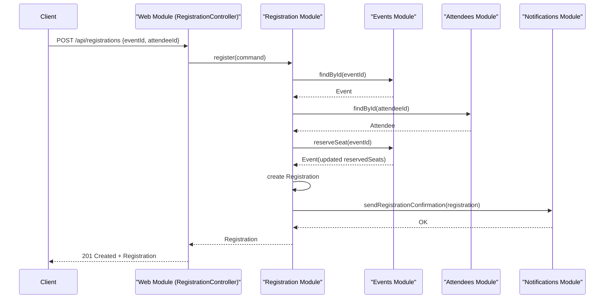

# Event Management - Skeleton

## Goal
This project is a simple and straight modular monolith for showing my skills in software engineer.
It uses:
- Java 25 (Maven compiler `release`)
- Spring Boot
- Spring Modulith
- Maven

## Module Overview
Base package: `com.kkarimi.eventmanagement`

Modules:
1. `events`
- Responsibility: create events, query events, reserve seats.
- Public API: `EventCatalog`, `Event`, `NewEventCommand`.
- Internal implementation: `events.internal.EventCatalogService`.

2. `attendees`
- Responsibility: register and query attendees.
- Public API: `AttendeeDirectory`, `Attendee`, `NewAttendeeCommand`.
- Internal implementation: `attendees.internal.AttendeeDirectoryService`.

3. `registration`
- Responsibility: register attendee in event.
- Dependencies: `events`, `attendees`, `notifications`.
- Public API: `RegistrationApplication`, `Registration`, `RegistrationCommand`.
- Internal implementation: `registration.internal.RegistrationApplicationService`.

4. `notifications`
- Responsibility: send registration confirmation (currently logging only).
- Public API: `NotificationGateway`.
- Internal implementation: `notifications.internal.LoggingNotificationGateway`.

5. `web`
- Responsibility: REST API layer.
- Dependencies: `events`, `attendees`, `registration`.
- Controllers: `EventController`, `AttendeeController`, `RegistrationController`.

## Why this structure is good for interviews
- Clear module boundaries with explicit dependencies.
- Internal implementations hidden in `.internal` packages.
- Stable module APIs (interfaces + command/record models).
- Easy to evolve from in-memory storage to JPA without breaking module contracts.

## Infrastructure Integration
- MariaDB is used as the system of record through Spring Data JPA.
- Redis is used for Spring Cache (event lookup/list caching).
- Configuration is in `/Users/karim/Public/event-management/src/main/resources/application.yml`.
- Container runtime setup is in `/Users/karim/Public/event-management/docker-compose.yml`.

## REST Endpoints
- `POST /api/events`
- `GET /api/events`
- `GET /api/events/{eventId}`
- `POST /api/attendees`
- `GET /api/attendees`
- `POST /api/registrations`
- `GET /api/registrations`

## Sequence Diagram


## Build and Run
```bash
mvn clean test
mvn spring-boot:run
```

Note:
- On Java 25, Spring Modulith's ArchUnit-based verification is currently skipped in `ModularityTest` because ArchUnit does not yet support Java 25 class files.
- The test runs automatically on Java 24 and below.

## Next recommended improvements
1. Add persistence per module (JPA repositories in each module).
2. Add domain events between modules (e.g., registration confirmed).
3. Add integration tests for endpoint flow.
4. Add authentication/authorization if requested in final project brief.
